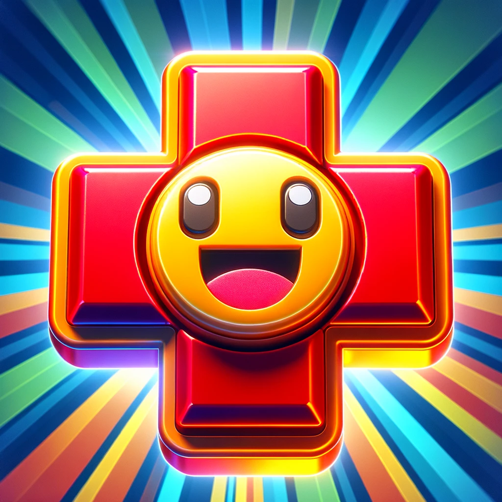
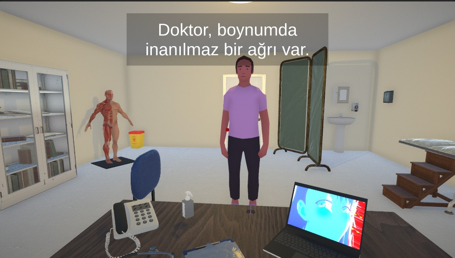

## Aman Doktor (Global Game Jam 2024)

    

**🎮 Tarayıcıda oyna:** https://anilbey.github.io/GGJ-2024/

**🎮 Play on the browser:** https://anilbey.github.io/GGJ-2024/

> "Aman doktor, canım gülüm doktor. Derdime bir çare. Çaresiz dertlere düştüm, doktor bana bir çare."

Amansız hastalıklarla tutulmuş vatandaşların dertlerine derman olma simülasyonu.

Bu oyun, oyuncuları amansız hastalıklarla savaşan doktorların rolüne sokar. Oyuncular, zorlu kararlar alarak ve tedavi yöntemleri uygulayarak hastaların hayatlarını kurtarmaya çalışır.

    

Bu oyun, 2024 Global Game Jam kapsamında geliştirilmiştir. "Güldür Beni" konusunu işleyerek, hastalara şifa dağıtıyoruz.

### Game Diversifiers

Oyun, farklı oyun mekanikleri ve temaları ile oyunculara çeşitli deneyimler sunmaktadır. Bu çeşitlendiriciler arasında:
- Carry on my Wayward Fun
- Multidevice

### Kullanılan Teknolojiler

- Unity 3D
- C#
